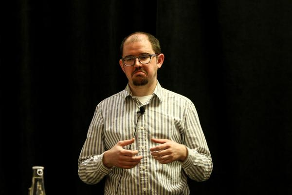
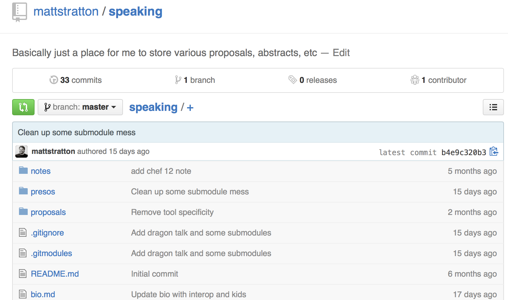
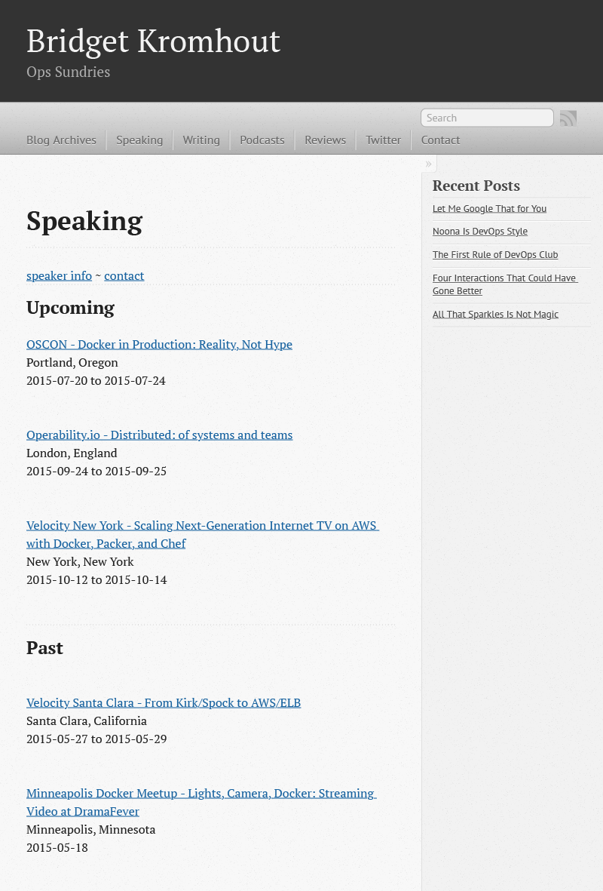

build-lists: true
autoscale: true

#[fit] How To Train Your(self)
#[fit]Dragon-Style
#[fit]To Submit Talks

---

# whoami

^ Oh yeah, I'm also @mattstratton on the twitters.
---

#[fit] Submitting a talk can be really intimidating

We spend a lot of time with “thought leaders” so we think that we need to have super insightful ideas

---

#[fit] You don’t have to write the whole talk to submit it

^ An abstract is enough. Just come up with an idea. One or two paragraphs is all you need. You don't even need to know that your idea will pan out.

---

#[fit] You can use a talk to learn something

---

## For example
- I have a theory about how to build a pipeline to use chef audit mode to test that cookbooks all work nicely together.
- I don’t have to know exactly HOW to do this to write an abstract
- I can just come up with the idea and I’ll learn how to do it as I write the talk

---
# Reminder
## Your abstract doesn't have to be "proven out"

---
#[fit]How do I come up with an idea for a talk, anyway?

---
#[fit]Your own experience

^ Even if someone else has spoken about a topic, YOUR experience is different than anyone else’s

---
## Something you've learned recently
## that you found super interesting

---
## Something you want to learn about

---
#[fit]Where to submit talks

---
#[fit]Forget about places like Velocity

^ The usual echo chamber can be intimidating and also doesn’t have as much value for Chef or your personal brand. Those folks know who we are.

---
#[fit]Places that aren't familiar with DevOps

- Local Dev meetups

- Agile conferences

- Software tester organizations

- You get the point...

- All kinds of tech conferences can be found at bit.ly/techconfs

^  Imagine if you give a talk at a local Dev meetup who doesn’t know anything about DevOps, so you give a DevOps 101 talk. And now they remember that when they learned about DevOps, it was loosely associated with Chef/you

---

#DevOpsDays Ignites

These are great places to try out (short talks), but have some challenges

- The Ignite format can be tough (but really fun)
- DevOpsDays are picky about repeated content

---

# You don't have to PREED it

^ This is a reference to J. Paul Reed who wants to have a new talk for every conference he speaks at. This is exhausting.

---

# Don't overkill

- Come up with one or two abstracts and submit them everywhere
- This is how the pros (i.e., Jez) do it
- Having to create new content for every engagement is exhausting

---

#Try out material "on the road"

^ Volunteer to give the talk at a local meetup first to polish it and make it shine before giving it at a conference.

It can be really helpful and less intimidating to present at an out-of-town meetup where you are not part of that group - you don't have to worry about your reputation (or perceived lack therof) of preceding you.

---
#Use the buddy system
###Peer reviews
- Co-workers
- Friends in the community
- Fust ask the twitters (if you're bold)

^ Bridget Kromhout has all of her blog posts peer-reviewed prior to publishing. Note that this isn't about having someone review your final deck (although that's not a bad idea), but rather getting input on your abstract.

---

#[fit]Q&A is your friend

^ If you don’t have enough “content” for a full talk, remember that Q&A can really help. This was advice that Nathen Harvey gave to a speaker at ChefConf and also Nicole Johnson suggests the same thing and it’s a good ramp-up.

---
#PROTIP #1
##Store all your speaking stuff in a github repo

___

---
#PROTIP #1.1
###Make all your presentations submobules

^ This was you can commit/work on them separately and possibly collaborate with someone only on the one talk.

---
#PROTIP #1.2
###Put your bio text in a text tile in github

---
#PROTIP #1.3
###Put all your proposals/abstracts in github also

---

#PROTIP #2
###Create a "speaker page" on your blog/website

^ This should include links to your past presentations, as well as a bio page with an area for download of your speaker headshot

---

## What are *your* goals?
